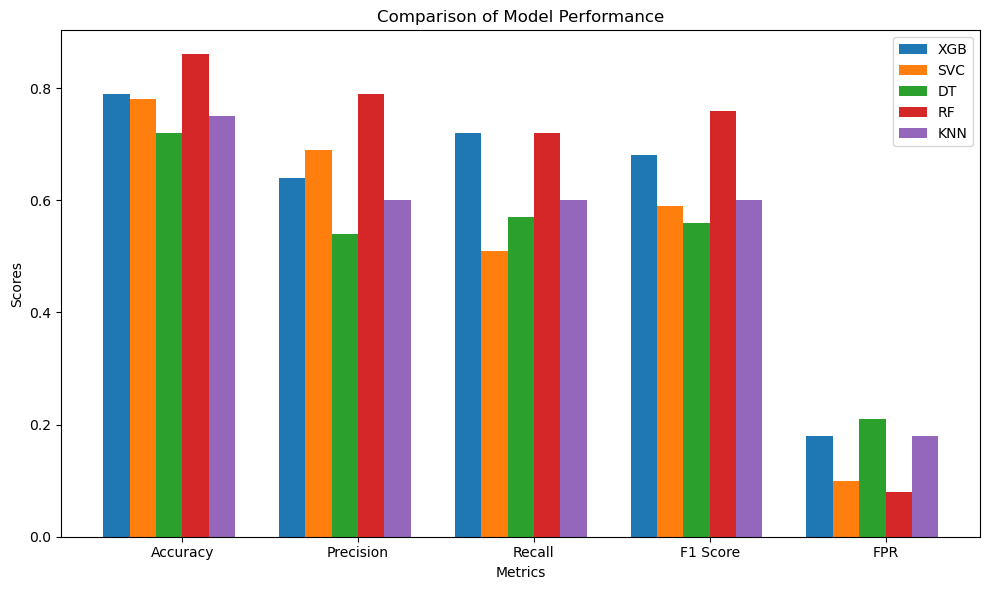
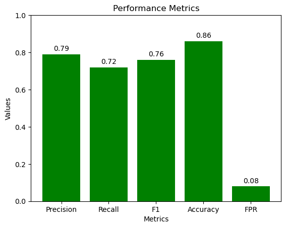
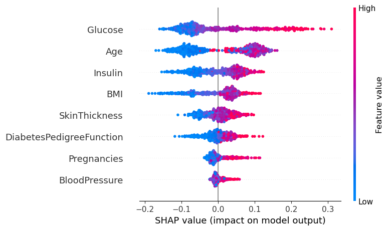
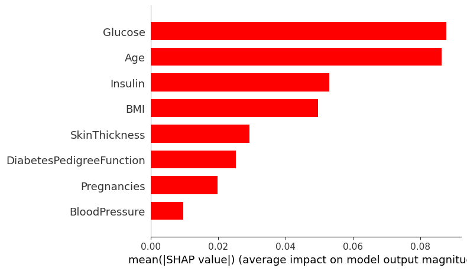
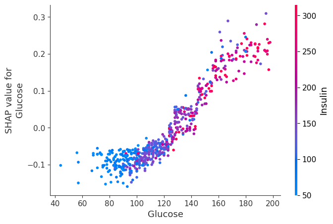

# Diabetes Risk Prediction - Machine Learning Project

## Overview

This project focuses on predicting diabetes risk using machine learning techniques and patient health indicators. The goal is to compare multiple classification models, evaluate their predictive performance, and improve model interpretability using SHAP values.

This project is intended for educational and analytical purposes and does not provide medical diagnosis.

## Project Objective

The main objective of this project is to build, evaluate, and compare machine learning models for diabetes risk prediction. Missing values were handled using `KNNImputer`, and the best-performing model was interpreted using SHAP values to better understand feature importance and model predictions.

## Dataset

The dataset contains patient health indicators related to diabetes risk prediction.

Main features include:

- Pregnancies
- Glucose
- Blood Pressure
- Skin Thickness
- Insulin
- BMI
- Diabetes Pedigree Function
- Age
- Outcome

The target variable is `Outcome`, where:

- `0` indicates non-diabetic
- `1` indicates diabetic

## Tools Used

- Python
- Pandas
- NumPy
- Scikit-learn
- XGBoost
- SHAP
- Matplotlib
- Seaborn
- Jupyter Notebook

## Project Workflow

1. Import libraries
2. Load dataset
3. Explore class distribution
4. Analyze feature correlations
5. Replace invalid zero values with missing values
6. Handle missing values using `KNNImputer`
7. Train and evaluate machine learning models
8. Compare model performance
9. Select the best-performing model
10. Interpret the Random Forest model using SHAP values

## Models Used

The following machine learning models were evaluated:

- Decision Tree
- XGBoost
- Support Vector Classifier
- Random Forest
- K-Nearest Neighbors

## Model Evaluation Metrics

The models were evaluated using the following classification metrics:

- Accuracy
- Precision
- Recall
- F1-score
- False Positive Rate

## Model Performance Summary

| Model | Accuracy | Precision | Recall | F1-score | FPR |
|---|---:|---:|---:|---:|---:|
| Random Forest | 0.86 | 0.79 | 0.72 | 0.76 | 0.08 |
| XGBoost | 0.79 | 0.64 | 0.72 | 0.68 | 0.18 |
| SVC | 0.78 | 0.69 | 0.51 | 0.59 | 0.10 |
| KNN | 0.75 | 0.60 | 0.60 | 0.60 | 0.18 |
| Decision Tree | 0.72 | 0.54 | 0.57 | 0.56 | 0.21 |

Based on the selected evaluation metrics, the Random Forest model achieved the best overall performance.

## Visualizations

### Model Comparison



### Random Forest Performance Metrics



### SHAP Summary Plot



### SHAP Feature Importance



### SHAP Dependence Plot — Glucose



## Model Interpretability with SHAP

SHAP values were used to interpret the best-performing Random Forest model. This helped explain the contribution of each feature to the model predictions and provided a clearer understanding of the most influential health indicators in diabetes risk prediction.

## Key Insights

- Random Forest achieved the best overall performance among the evaluated models.
- KNNImputer was used to handle missing values in health-related features.
- Glucose, BMI, Age, and Insulin were among the important variables in model interpretation.
- SHAP analysis improved the transparency of the model by explaining how features contributed to predictions.
- Combining model comparison with interpretability methods makes machine learning results more understandable and useful.

## Project Structure

```text
diabetes-risk-prediction-ml/
│
├── README.md
├── diabetes_risk_prediction.ipynb
│
├── data/
│   └── diabetes.csv
│
└── assets/
    └── charts/
        ├── model_comparison.png
        ├── rf_metrics.png
        ├── shap_summary.png
        ├── shap_feature_importance.png
        └── shap_dependence_glucose.png
```

## How to Run This Project

1. Clone or download this repository.
2. Place the dataset inside the `data/` folder.
3. Open `diabetes_risk_prediction.ipynb` in Jupyter Notebook.
4. Run the notebook cells from top to bottom.

Make sure the dataset path is set as:

```python
data = pd.read_csv("data/diabetes.csv")
```

## Project Files

- `README.md`: Project documentation, including overview, workflow, model comparison, insights, and visualizations.
- `diabetes_risk_prediction.ipynb`: Main Jupyter Notebook containing preprocessing, model training, evaluation, and SHAP analysis.
- `data/diabetes.csv`: Dataset used for diabetes risk prediction.
- `assets/charts/model_comparison.png`: Model comparison visualization.
- `assets/charts/rf_metrics.png`: Random Forest performance metrics chart.
- `assets/charts/shap_summary.png`: SHAP summary plot.
- `assets/charts/shap_feature_importance.png`: SHAP feature importance chart.
- `assets/charts/shap_dependence_glucose.png`: SHAP dependence plot for Glucose.


Tools: Python, Scikit-learn, XGBoost, SHAP
